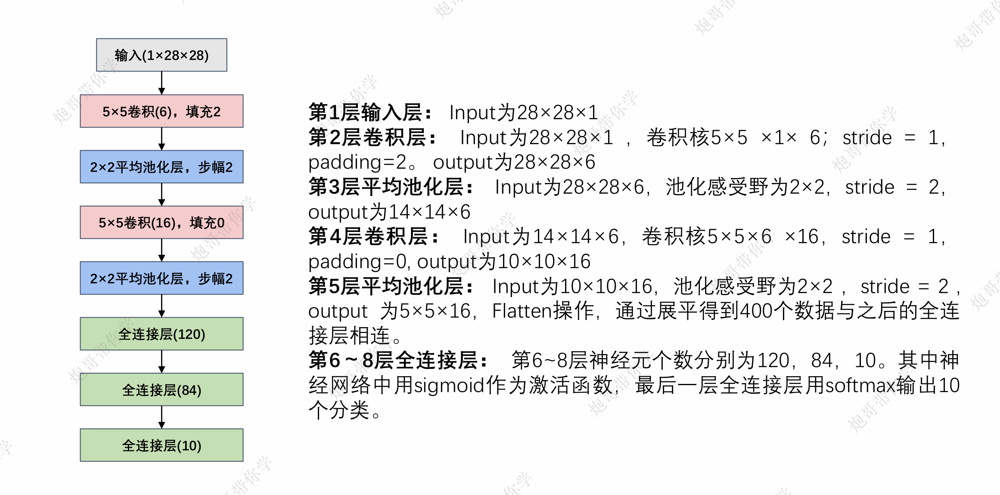

# 手动实现LeNet-5深度神经网络
### 下面是leNet-5的解释和介绍

### 在神经网络中，每一层的输出
#### 假设有一个简单的CNN用于手写数字分类：

    import torch.nn as nn
    class SimpleCNN(nn.Module):
        def __init__(self):
            super(SimpleCNN, self).__init__()
            self.conv1 = nn.Conv2d(in_channels=1, out_channels=32, kernel_size=3, padding=1)
            self.pool = nn.MaxPool2d(kernel_size=2, stride=2, padding=0)
            self.fc = nn.Linear(32*14*14, 10)  # 假设输入图像大小为28x28
            
        def forward(self, x):
            x = self.pool(F.relu(self.conv1(x)))  # 卷积+ReLU激活+最大池化
            x = x.view(-1, 32*14*14)  # 展平操作
            x = self.fc(x)  # 全连接层
            return x
**各层输出解释**

- 输入层：输入通常是形状为 [batch_size, channels, height, width] 的张量，例如 [64, 1, 28, 28] 表示一个批次大小为64、单通道（灰度图像）、尺寸为28x28的手写数字图像。
- 第一层卷积层（Conv2d）：对输入图像应用一组可学习的滤波器。输出是一个形状为 [batch_size, out_channels, new_height, new_width] 的张量，在这个例子中可能是 [64, 32, 28, 28]，表示每张图片现在有32个特征图（每个对应于不同的滤波器）。
- 激活函数（ReLU）：将卷积层的输出传递给ReLU函数，它会将所有负值变为0，保持正值不变。这一步的输出与上一步相同，但所有的负值都被置零了。
- 池化层（MaxPool2d）：对每个特征图进行下采样，减少参数数量和计算量。在这个例子中，输出可能是 [64, 32, 14, 14]，因为每个维度都缩小了一半。
- 展平操作：将三维张量（[batch_size, channels, height, width]）转换为一维向量，以便能够输入到全连接层。此时输出形状变为 [64, 32*14*14]。
- 全连接层（Linear）：将展平后的向量映射到类别空间。如果任务是分类0-9的手写数字，则输出维度将是 [64, 10]，表示每个样本属于各个类别的得分。
- 最终输出：最后你可以选择是否应用Softmax来将得分转化为概率分布，但这不是必须的，特别是在训练阶段。